Piscine
==

Description
===

Plugin permettant de gérer la filtration d'une piscine en fonction de la température.
Le plugin gère également les fonctions suivantes :

- Filtre à sable.
- Surpresseur pour robot nettoyeur.
- Hivernage actif.
- Asservissement chauffage solaire.

Configuration
==

Installation
===

L'installation du plugin ne demande aucune configuration particulière.

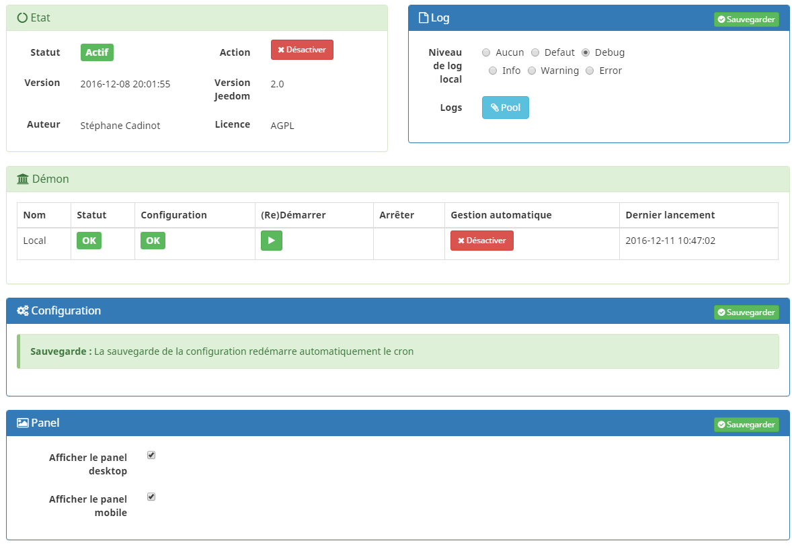

Configuration
===

Après l'installation, il vous suffit de l’activer et de vous rendre sur l’écran de configuration :

Commencez par créer un nouvel équipement :

L'écran de configuration suivant apparait alors.

Positionnement
====

Commencez par positionner votre équipement piscine dans l'objet Jeedom de votre choix et activez-le.

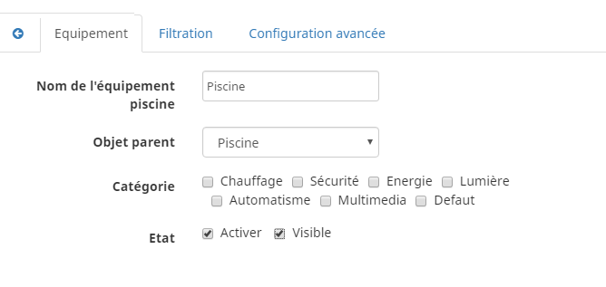

Choix des options
====

Les options suivantes peuvent être choisies:

Activez les options de votre choix suivant le type d'équipement dont vous disposez sur votre piscine.

Voyons ensemble le détail des options sélectionnables:
=====

- Traitement

    Cette option vous permet de contrôler l'asservissement d'équipements de traitement automatique de l'eau tels pompe d'injection de Ph, de Chlore...
    Les équipements seront activés 5 secondes après le démarrage de la filtration et stoppés 5 secondes avant l'arrêt de la filtration.
    Ils ne seront pas activés lors de l'hivernage ou les opérations de nettoyage du filtre à sable.

- Surpresseur

    Cette option vous permet de contrôler l'asservissement d'un surpresseur pour piloter un robot de nettoyage type Zodiac Polaris.

- Filtre à sable

    Cette option vous permet de fournir un assistant pour les opérations de lavage / rinçage d'un filtre à sable.

- Hivernage

    Cette option vous permet de basculer l'installation en mode hivernage actif. Le cycle de filtration est modifié lors de l'activation de cette option.
    Trois options sont disponibles : Actif / Inactif / Widget.
    Si vous choisissez Widget les boutons 'Saison' et 'Hivernage' seront affichés sur le panel ce qui vous permet de changer de mode sans passer par la configuration.

**IMPORTANT**

Si vous choisissez pas Widget, vous devez activer cette option uniquement au début de l'hivernage et la désactiver à la fin de l'hivernage pour revenir au cycle de filtration classique.

- Asservissement externe

    Cette option vous permet d'activer l'asservissement externe. Si cette option est inactive le widget du plugin affichera des boutons permettant de changer l'état du plugin.

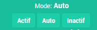

Sonde de température
====

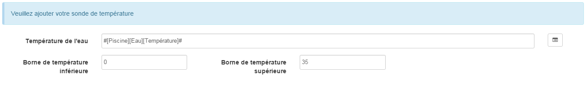

Il suffit simplement de définir l'équipement de votre installation destiné à mesurer la `température de l'eau`.

Les champs `Borne de température inférieure` et `Borne de température supérieure` permettent de définir une alerte en cas de données erronées renvoyées par la sonde.

Onglets de configuration
====

_Certains de ces onglets sont visibles en fonction des options choisies précédemment._

Onglet [Filtration]
=====

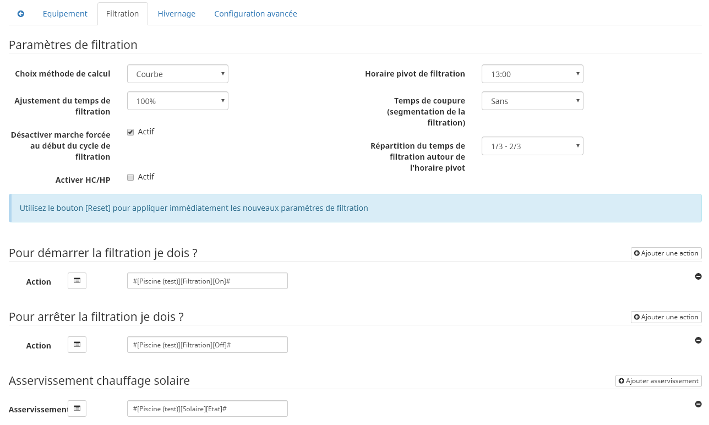

_C'est l'onglet principal de l'installation, il est toujours visible quelque soit la configration choisie._

Dans cet onglet, vous devez définir les paramétres du calcul de temps de la filtration.

`Choix méthode de calcul` : vous permet de choisir entre un calcul de temps de filtration basé sur une courbe ou la classique formule température / 2.

`Ajustement du temps de filtration` : vous permet d'ajuster le temps de filtration avec un coefficient variable entre 60% et 140%.

`Désactiver marche forcée au début du cycle de filtration` pour revenir au mode auto au début du cycle de filtration, afin d'éviter de laisser indéfiniment la marche forcée. Cette option n'est présente que si l'asservissement externe est désactivé.

`Horaire pivot de filtration` : vous permet de définir l'heure de la filtration.

`Temps de coupure (segmentation de la filtration)` : vous permet de faire une pause pendant la filtration, cette pause est située à l'heure pivot choisie. Les heures de début et de fin de filtration sont décalées proportionnellement. Utilisez le bouton test pour visualiser et déterminer les horaires souhaités.

`Répartition du temps de filtration autour de l'horaire pivot` : vous permet de choisir la répartition de la plage de filtration autour de l'heure pivot, au choix 1/2 <> 1/2 ou 1/3 <> 2/3.

Voici le détail de la courbe de filtration, la courbe bleue représente la valeur 100%, la courbe verte 140% et la courbe rouge 60%.

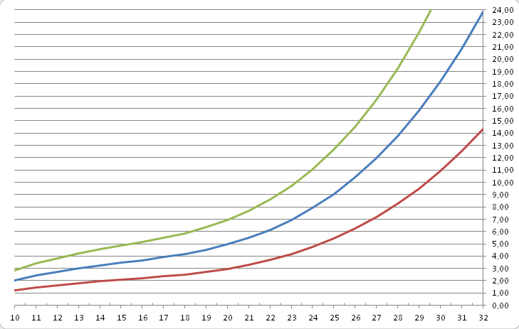

*_Exemple de calcul :_*

Pour une eau à 30.2°C avec le mode courbe, un ajustement à 100%, un horaire pivot à 12:00 et une répartition 1/3 - 2/3. la plage de filtration sera 05:46 <> 00:27.

Dans la partie basse de cet onglet, vous devez définir les équipements permettant de `démarrer la filtration` et d' `arrêter la filtration`.

Une autre option est présente, l' `Asservissement chauffage solaire`.
Cela vous permet définir un forçage de la filtration dans le cas d'une installation de chauffage solaire. La filtration démarrera alors quel que soit le programme en cours.

Onglet [Traitement]
=====

_Cet onglet est visible si vous avez activé l'option correspondante dans la configuration._

Dans cet onglet, vous devez définir les équipements permettant de `démarrer le traitement` et d' `arrêter le traitement` de l'eau de la piscine. Comme déjà précisé, les équipements seront activés 5 secondes après le démarrage de la filtration et stoppés 5 secondes avant l'arrêt de la filtration.

[IMPORTANT]

Il ne s'agit pas d'une régulation de Ph ou autre, mais d'un asservissement de ce type d'équipement possédant sa propre régulation.

Onglet [Surpresseur]
=====
 

_Cet onglet est visible si vous avez activé l'option correspondante dans la configuration._

Dans cet onglet, vous devez définir le `Temps de fonctionnement du surpresseur` et les équipements permettant de `démarrer le surpresseur` et d' `arrêter le surpresseur`.
Sur le Dashboard, vous trouverez un bouton permettant de lancer le surpresseur et une indication du temps de nettoyage restant.

Onglet [Filtre à sable]
=====
 
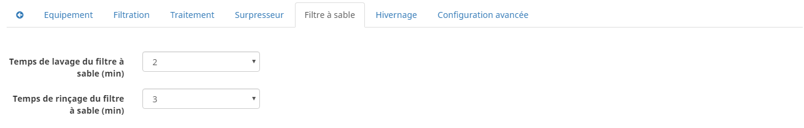

_Cet onglet est visible si vous avez activé l'option correspondante dans la configuration._

Dans cet onglet, vous devez définir le `Temps de lavage du filtre à sable` et `Temps de rinçage du filtre à sable`
Sur le Dashboard, vous trouverez un bouton permettant de lancer le nettoyage du filtre une indication du temps de restant et du positionnement de la vanne du filtre à sable.

Onglet [Hivernage]
=====

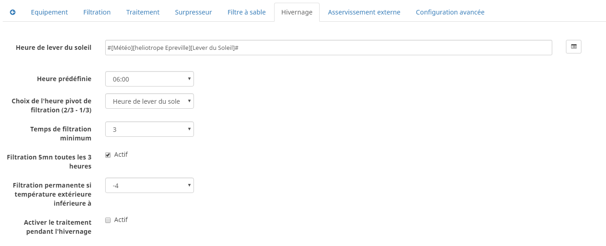

_Cet onglet est visible si vous avez activé l'option correspondante dans la configuration._

Dans cet onglet, vous devez définir plusieurs éléments importants pour réussir votre hivernage actif.

`Température extérieure` : choisissez dans vos équipements la sonde mesurant la température extérieure, si vous n'en possédez pas, choisissez la température du plugin Météo.

`Heure de lever du soleil` : choisissez l'heure de lever du soleil dans le plugin Météo.

`Heure prédéfinie` : choisissez l'heure à laquelle vous souhaitez lancer la filtration en mode hivernage.

`Choix de l'heure pivot de filtration (2/3 - 1/3)` : choisissez si vous souhaitez lancer la filtration à l'haure de lever du soleil ou à l'heure prédéfinie.

*_Attention :_*

Si vous choisissez un horaire différent de l'heure de lever du soleil la fonction hors gel de la filtration sera sans effet.
Cette fonction peut être utile suivant votre abonnement EDF (possibilité de faire fonctionner la filtration pendant les heures creuses.

`Temps de filtration minimum` : par défaut la filtration en mode hivernage est calculée en divisant la température de l'eau par 3 avec un temps minimum configurable.

`Filtration 5mn toutes les 3 heures` : si vous le souhaitez vous pouvez activer cette option qui lancera la filration pendant 5mn toutes les 3 heures.

`Filtration permanente si température extérieure inférieure à` : cette option permet de lancer la filtration en marche forcée si la température extérieure descend en dessous d'un seuil défini.

`Activer traitement pendant l'hivernage` : cette option permet d'activer le traitement pendant l'hivernage.

*_Principe et fonctionnement de l'hivernage :_*

La filtration est lancée tous les jours au minimum pendant 3 heures, la filtration démarrera 2 heures avant le lever du soleil et s'arrêtera 1 heure après le lever du soleil.
Si la température de l'eau est supérieure à 9°C, le temps de filtration sera calculé en divisant la température par 3 (soit par exemple 3h20 pour 10°C).
Le démarrage de la filtration étant dans tous les cas 2 heures avant le lever du soleil.
Si vous avez activé l'option `Filtration 5mn toutes les 3 heures` la filtration sera lancée indépendamment de toute programmation de 02h00 à 02h05, de 05h00 à 05h05, de 08h00 à 08h05, de 11h00 à 11h05, de 14h00 à 14h05, de 17h00 à 17h05, de 20h00 à 20h05, de 23h00 à 23h05.
L'option `Filtration permanente si température extérieure inférieure à` est une sécurité supplémentaire dite *_hors gel_* qui permet éventuellement de filtrer en continu dans le cas de températures très basses.

Onglet [Asservissement externe]
=====
 
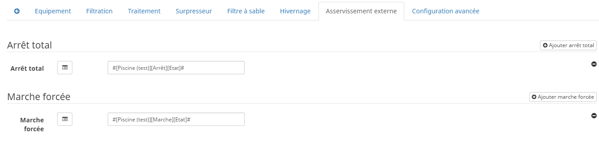

Dans cet onglet, vous devez définir les équipements permettant de piloter la filtration. Cet onglet n'est visible que si vous activez l'option correspondante.

`Arrêt total` : choisissez l'équipement qui imposera au plugin un arrêt total quel que soit l'évènement. Cela peut par exemple vous permettre d’intervenir sur l’installation en étant sur que la filtration ne démarrera pas.

`Marche forcée` :  choisissez l'équipement qui imposera au plugin le démarrage forcé de la filtration. Notez que l’arrêt total est prioritaire sur la marche forcée.

Ces deux équipements reçoivent des types infos.
Il faut donc y mettre les contacts d'un interrupteur RFXcom ou ZWave ou bien encore l'info d'un virtuel qui vous permettra de piloter la filtration à partir du Dashboard.

Exemple de configuration.

Onglet [Configuration avancée]
=====
 
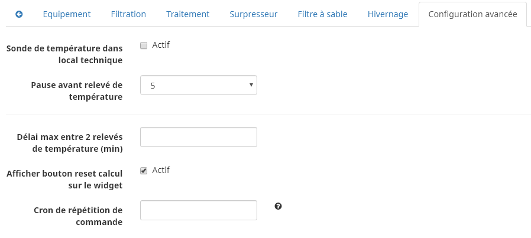

Dans cet onglet vous pouvez définir :

`Sonde de température dans local technique` pour ne tenir compte de la valeur renvoyée par la sonde que pendant la filtration.

`Pause avant relevé de température` temporisation pour attendre que la température de la sonde soit au niveau de la température du bassin. Ce délai depend de la puissance de votre pompe et de la longueur du circuit de filtration entre la piscine et la sonde.

`Délai max entre 2 relevés de température` pour activer une alerte en cas de défaillance de la sonde de température.

`Afficher bouton reset calcul sur le widget` pour activer un bouton [Reset] sur le Widget qui permet de relancer le calcul de temps de filtration.

`Cron de répétition de commande` Cron de renvoi des commandes de filtration, surpresseur et traitement. Si vos équipements ne démarrent ou ne s'arrêtent pas correctement mettez en place cette vérification. Laissez vide le champ pour désactiver l'option.

D’autres options seront ajoutées dans les versions futures du plugin Piscine.

Fonctionnement
==

Cycle de filtration.
===

A la fin du cycle, le plugin recalcule la nouvelle plage de filtration.
Ce calcul est lancé uniquement à la fin du cycle.
Si vous souhaitez relancer le calcul avant la fin du cycle, activez le bouton [Reset] dans l'onglet [Configuration avancée].

Widget Piscine sur le Dashboard
===

Sur le widget sont indiqués :

- la température de l'eau.
- la température de l'air (en mode hivernage uniquement).
- le temps de filtration.
- les horaires de filtration.
- un bouton [Reset] (si activé dans la configuration).
- l'état de la filtration.
- un bouton [On] de lancement du surpresseur (si activé dans la configuration)
- l'état du surpresseur (si activé)
- un bouton [Start] de lancement du nettoyage du filtre à sable (si activé dans la configuration)
- l'état du filtre à sable (si activé)
- un bouton [Stop] (si surpresseur ou filtre à sable)

Si votre sonde de température est située dans le local technique. Il est conseillé de sélectionner l’option correspondante dans la configuration.
La température affichée sera alors celle de piscine, même lorsque la filtration sera stoppée (la dernière valeur mesurée).
Le widget indiquera alors température eau pour indiquer cette option.

Surpresseur
====

Pour activer le surpresseur, cliquez sur le bouton [On], le surpresseur est alors lancé pour une durée spécifiée dans la configuration.
Si la filtration n'est pas active, elle sera lancée automatiquement, puis ensuite le surpresseur après une temporisation de quelques secondes.

Cette temporisation permet d'éviter d'endommager le surpresseur en mettant en mouvement l'eau dans le circuit de filration.

Une fois le surpresseur lancé le widget affiche le temps restant sous forme de compte à rebours.

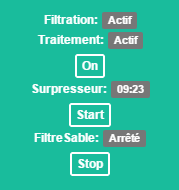

A la fin de la temporisation, le surpresseur s'arrête ainsi que la filtration si elle n'était pas active auparavant.
Le bouton [Stop] permet d'arrêter le cycle avant la fin de la temporisation si nécessaire.

Nettoyage du filtre à sable
====

Cette fonctionnalité est un assistant pour vous guider dans les opérations de lavage de votre filtre à sable.

Pour lancer le lavage, cliquez sur [Start], la filtration est alors stoppée et le widget affiche :

Comme demandé sur le Widget, positionnez votre vanne sur la position [lavage], puis cliquez à nouveau sur [Start].

La filtration démarre, le plugin affiche alors le temps restant pour l'opération de lavage :

A la fin du lavage, le plugin affiche le message suivant:

Comme demandé sur le Widget, positionnez votre vanne sur la position [Rinçage], puis cliquez à nouveau sur [Start].

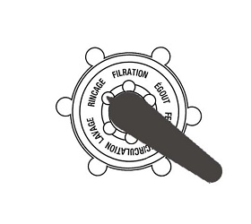

La filtration démarre, le plugin affiche alors le temps restant pour l'opération de rinçage :

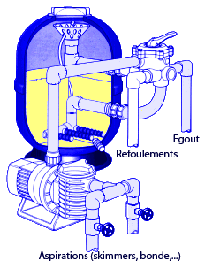

A la fin du rinçage, le plugin affiche le message suivant :

Comme demandé sur le Widget, positionnez votre vanne sur la position [Filtration], puis cliquez à nouveau sur [Start].

Si la filtration était active avant l’opération de lavage, elle redémarre automatiquement.

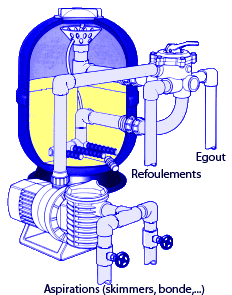

Visualisation du fonctionnement de la piscine
===

Une fois votre piscine configurée, vous pouvez contrôler les temps de filtration.

Dans le menu `Accueil`, on trouve le sous-menu `Piscine`. La fenêtre qui s'affiche lorsqu'on sélectionne ce menu est découpée en trois zones :

* Le _widget_ Piscine, pour visualiser l'état actuel de la piscine,

* un graphique représentant le cumul du temps de filtration par jour (en nombre d'heures),

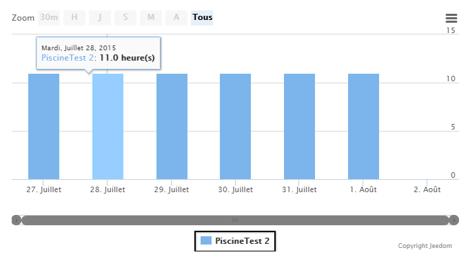

* un autre graphique qui affiche les courbes de température de l'eau et l'état de la filtration.

_Sans l'option "sonde local technique", on voit la température qui redescend quand la filtration est stoppée._

_Avec l'option "sonde local technique", la température reste constante quand la filtration est stoppée._

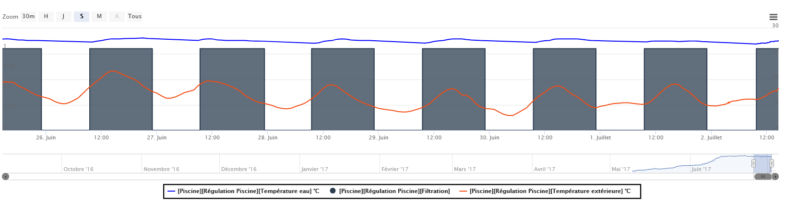

FAQ
==
 
Température
===

La température prise en compte pour le calcul est la température maximum mesurée pendant la filtration.

La filtration ne se lance pas
===

- Verifiez dans les logs que le calcul de durée est correct.
- Pour afficher le temps de calcul la configuration des logs doit au minimum être au niveau INFO.

- L'affichage doit avoir la forme suivante

- Vérifiez que la date de la fitration est bien celle de la prochaine journée.
- Ce calcul est effectué juste à la fin de la plage de filtration du jour.

Quel type de sondes gère le Plugin
===

Toutes les sondes (Flottantes, Collier de prise en charge) sont prise en compte par le plugin.
